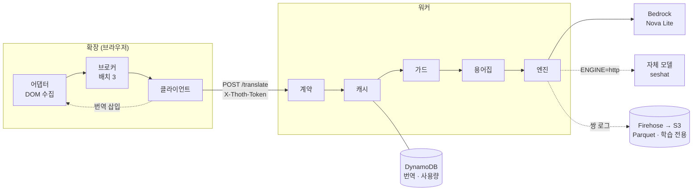

# thoth

영어 학습 사이트의 문항을 **화면에 이미 떠 있는 상태 그대로 읽어** 한글 번역을
겹쳐 보여주는 크롬 확장과 번역 백엔드.

AWS Certified Data Engineer(DEA-C01) 문제를 풀면서 직접 쓰려고 만들었다.
이름은 문자와 언어의 신 토트에서 왔다.

**껍데기로서 완성됐다.** 확장 · 워커 · 배포 · 쌍 로그가 돌고, 번역 엔진은 갈아끼우는 자리
(`ENGINE=http`)가 열려 있다. 자체 번역 모델은 비공개 저장소 `seshat` 에서 사전학습 모델을
좁혀 만든다 — 토트(문자의 신)의 짝인 기록의 여신 세샤트에서 따온 이름이다. 두 저장소를 한
제품으로 적은 **통합 기획서**(제안서 · 요구사항 분석서 · 상세 설계서, 40쪽)를
[웹에서 볼 수 있다](https://cleveraifox.github.io/thoth/proposal.html).

**돌고 있다.** Lambda 에 올라가 있고 Udemy 실사이트에서 확인했다 — 문항 하나가
**5.3초**(로컬 엔진은 80.7초), 45유닛 골든셋에서 위반 4유닛(용어 2 · 고유명사 1 · 어미 1),
환각·문체 위반 0건이다. 고유명사는 대체로 영어로 남되 `Data Catalog` 하나가
네 판 모두 새어 나간다(DECISIONS §81).



**한 방향으로만 흐른다.** 어댑터가 모은 것이 브로커에서 묶이고, 워커가 캐시 →
상한 → 용어집 순으로 거른 뒤 남은 것만 모델에 간다. **캐시에서 끝나면 모델을
부르지 않는다** — 비용도 지연도 거기서 0 이다.

로컬은 FastAPI 로 같은 계약을 돌리고, 배포본은 Lambda + Function URL 이다.
**두 경로가 같은 `contract.py` 를 부르므로 같은 입력에 같은 답이 나온다.**

```
[로컬]   uvicorn  →  app/main.py            →  contract.py
[배포]   Function URL  →  app/lambda_handler.py  ↗
```

---

## 무엇이 다른가

| | 흔한 방식 | thoth |
|---|---|---|
| 수집 | 사이트를 스크래핑해 문항을 모은다 | 사용자 화면의 DOM 만 읽는다 |
| 번역 시점 | 전량을 미리 번역해 배포한다 | 본 것만, 한 번만 |
| 배포물 | 번역된 원문 사전 | 없다 |
| 사이트 대응 | 대상 사이트 전용 | 제네릭 폴백 + 사이트 어댑터 |

**저작권물을 재배포하는 주체가 없다.** 원문을 공급하는 것은 저장소가 아니라
사용자 본인의 브라우저다. 번역 결과는 서버 캐시에 남는 파생물이고 배포되지
않는다.

---

## 어댑터 3계층

`priority` 가 높은 것부터 `match()` 를 물어 첫 번째를 쓴다.

| 계층 | 사이트 지식 | 하는 일 |
|---|---|---|
| `generic` | **0** | 말단 블록 요소를 수집한다. `match` 가 항상 참 |
| `standard` | **0** | ARIA 역할과 라디오 `name` 으로 묶음을 인식한다 |
| `udemy` | 있음 | 전용 셀렉터와 레이아웃 보정 |

Layer 0 이 항상 참이므로 **어댑터가 없는 사이트에서도 번역이 동작한다.**
어댑터는 동작 조건이 아니라 정확도를 높이는 장치다. 새 사이트 대응은 어댑터
파일 하나 추가로 끝나고 브로커·워커는 건드리지 않는다.

---

## 용어 보존

기계번역은 `Kinesis Data Streams` 를 `Kinesis 데이터 스트림` 으로 번역한다.
자격증 학습에서는 시험에 영어로 나올 이름을 한글로 외우게 되는 문제가 된다.

thoth 는 두 층으로 막는다.

- **보편 규칙** — 고유명사·API명 영어 유지, 조사 자연 부착, 원문에 없는 내용
  추가 금지. 도메인 지식이 0 이고 어느 사이트에서나 같다.
- **도메인 용어집** — `worker/app/glossary/*.json`. 어느 용어집을 쓸지 코드가
  판단하지 않고 **원문에 실제로 나타난 용어 수**가 정한다. 없어도 번역은 동작한다.

용어집의 목표는 커버리지가 아니라 **이미 발견한 오류의 재발 방지**다. 그래서
"등재 용어 위반 0" 이라는 측정 가능한 불변식이 생긴다.

---

## 비용 설계

| 장치 | 효과 |
|---|---|
| 서버 공유 캐시 (`sha256(원문)`) | 재방문·재시작·타 사용자 모두 0원 |
| 배치 묶음 | 요청 수가 줄면 프롬프트 머리가 그만큼 덜 실린다 |
| 실사용분만 번역 | 전량 선불이 없다 |
| 월 문자 상한 하드 스톱 | DynamoDB 조건부 원자 증가. 동시 실행에도 새지 않는다 |
| ALB · NAT · 스트리밍 미사용 | 서빙 경로에 시간당 과금 리소스를 두지 않는다 |
| 접근 토큰 (`WORKER_TOKEN`) | 상한을 누가 태우는지 정한다 |

**상한은 원문 기준이고 과금은 입력 토큰 기준이다.** 실측에서 문항 한 페이지의
원문이 2,512자인데 프롬프트를 포함한 실제 입력은 19,747자였다. 상한을 비용의
대리 지표로 읽으면 7배 틀린다.

**상한은 비용을 막지 남용을 막지 않는다.** 지출은 상한에서 멈추지만 남이 그
상한을 태우면 지출은 0원 늘지 않은 채 정당한 사용자가 429 를 받는다. 토큰이
비면 워커가 열리고(로컬 기본값) 채우면 헤더를 요구한다. 확장에 심는 토큰은
사용자가 꺼내볼 수 있으므로 비밀이 아니라 **엔드포인트를 주운 사람을 거르는
장치**다. 완전하지 않다는 이유로 아무것도 두지 않는 쪽이 더 나쁘다.

가드에 걸려도 **캐시 히트는 돌려준다.** 히트는 과금이 0 이라 상한과 관계가
없다. 못 채운 자리만 비우고 사유를 실어 보낸다.

캐시 키에 사이트를 섞지 않는다. 같은 문장이 여러 사이트에 나오므로, 사이트가
늘수록 히트율이 올라가는 구조가 된다.

---

## 실행

**워커는 각자 띄운다.** 확장의 기본 엔드포인트는 `127.0.0.1:8000` 이고 여기
적힌 배포본은 내 계정의 것이다. 받아서 바로 쓰는 물건이 아니라 **띄우고 나서
쓰는 물건**이다(DECISIONS §84).

```bash
cp .env.example .env

bash tools/run_ollama.sh &   # ENGINE=local 일 때
bash tools/run_worker.sh
bash tools/sync_ext.sh       # 확장을 로컬 경로로 내보낸다
```

배포본은 따로 세운다. 순서가 어긋나면 `plan` 이 zip 을 못 찾아 멈춘다.

```bash
bash tools/package_lambda.sh                               # zip 이 먼저다
cp infra/terraform.tfvars.example infra/terraform.tfvars   # worker_token 을 채운다
bash tools/tf.sh init
bash tools/tf.sh apply
WORKER_URL=<출력> WORKER_TOKEN=<토큰> bash tools/smoke.sh   # 배포본을 실제로 때린다
```

`chrome://extensions` → 개발자 모드 → 압축해제된 확장 프로그램을 로드.
**아무 사이트에서나 아이콘을 눌러 "이 사이트에서 켜기" 를 한 번 승인하면 이후
자동으로 동작한다.** 특정 사이트를 미리 등록해 두지 않으므로 저장소에 사이트
목록이 없다. 같은 팝업에서 번역 표시를 끄고 켜거나(`Alt+K` 와 같다) 워커 연결을
확인할 수 있고, 엔드포인트와 토큰은 고급에 접혀 있다.

```bash
bash tools/package_lambda.sh  # 배포 zip — 의존성 0 을 검사로 확인한다
bash tools/tf.sh plan         # 인프라. .env 의 프로파일을 풀어 넘긴다
bash tools/tf.sh apply
bash tools/preflight.sh       # 엔진 전제만 본다 — 띄우기 전에 죽는 편이 낫다
bash tools/bedrock_survey.sh  # Bedrock 쪽 실정을 잰다. 아무것도 바꾸지 않는다
bash tools/apply_patch.sh     # 윈도우 다운로드의 패치를 적용한다
bash tools/smoke.sh           # 워커를 띄운 상태에서 계약을 실제로 때린다
python3 tools/bench_golden.py # 골든셋 — 번역 품질 불변식
python3 tools/bench_endings.py            # 후처리 어미 — 맞음 · 그대로 · 틀림
python3 tools/engine_conformance.py <URL>  # 자체 모델 서버가 ENGINE=http 계약을 지키는가
bash tools/bench_engine.sh <모델>  # 엔진 후보 비교 — 로딩 제외 2회차가 체감
bash tools/bench_batch.sh 9 6 3   # 배치별 비교 — 조건을 스스로 본다
bash tools/scan.sh            # 실정을 잰다 — 위생 대상의 근거
bash tools/doctor.sh          # 비밀값 · .env 정합 · 훅 · 산출물 · 문서 · 테스트 · 배포 게이트
                              # FAIL 은 커밋을 막고 WARN 은 알리고 넘어간다
bash tools/doctor.sh --repo   # 저장소 불변식만. 커밋 훅과 CI 가 쓰는 범위
python3 tools/check_docs.py   # 문서 ↔ 문서 — 문체 · 절 · PLAN 표 · 참조 (규약은 MASTER §0)
python3 tools/doc_fsck.py     # 문서 ↔ 실물 — 경로 · 테스트 · 죽은 도구
python3 tools/docx_check.py   # 기획서 ↔ 정본 — 숫자 · 폐기된 값
bash tools/ship.sh "메시지"   # doctor → 문서 대조 → 커밋 → 푸시 안내
python3 tools/sweep.py        # 위생 — 저장소 밖에 남긴 흔적
node --test "extension/tests/*.test.js"   # 확장 — 팝업 판정 · 어댑터 수집
                              # 어댑터 검사에는 jsdom 이 필요하다 (cd extension && npm install)
```

---

## 엔진

| `ENGINE` | 대상 | 용도 |
|---|---|---|
| `echo` | `[KO] 원문` | DOM·렌더링 작업. 과금 0 |
| `local` | Ollama · `exaone3.5:7.8b` | 오프라인 개발 · 품질 기준선 |
| `translate` | AWS Translate | 비교 대상 |
| `bedrock` | Bedrock Converse · `nova-lite` | **배포본. 533자/초** |
| `http` | 자체 모델 서버 | **갈아끼우는 자리.** 계약과 적합성 검사만 있다(`docs/MASTER.md` §7-4) |

**`local` 과 `bedrock` 은 같은 코드 경로를 탄다.** 용어집 선택, 배치 규약,
파싱 실패 시 개별 폴백, 후처리는 엔진의 성질이 아니라 이 도구의 성질이라
한 곳에 있고 엔진은 "한 프롬프트를 처리하는 함수" 만 다르다. 그래서 골든셋
결과가 같은 기준으로 비교된다.

**자체 모델은 `http` 로 끼운다.** 서버가 `POST /translate` 에 원문 배열을 받아 같은
길이의 번역 배열을 돌려주고 `GET /health` 에 모델명을 말하면 된다. 프롬프트는 보내지
않고 용어집만 `terms` 로 싣는다. 끼우기 전에 계약을 잰다.

```bash
python3 tools/engine_conformance.py https://<서버> --model <이름>
```

통과하면 `infra/terraform.tfvars` 의 `engine = "http"` 와 `http_url` · `http_model` 로
`apply` 한다. 확장도 워커 계약도 바뀌지 않고, 되돌리는 것은 `engine = "bedrock"` 한
줄이다(`docs/MASTER.md` §7-4).

`invoke_model` 이 아니라 Converse API 를 쓴다. 요청 본문 스키마가 모델마다
달라서, `invoke_model` 로 붙이면 모델을 바꿀 때 호출 코드를 다시 쓰게 된다.

**호스팅 실측은 문항 하나에 5.3초다**(45유닛 · 배치 3 · Nova Lite). 로컬은
같은 조건에서 80.7초이고 콜드 로딩 87.6초가 더 붙는다. 위반은 호스팅 4유닛 ·
로컬 3유닛이며, 로컬 값은 프롬프트를 고치기 전의 것이라 재측정 대기다.

**로컬 엔진은 내렸다**(DECISIONS §95). 품질이 아니라 속도다 — GTX 1660 Ti
기준 문항 하나에 81초다(배치 3). 모델이 내려가 있으면 첫
페이지에 로딩 71초가 더 붙는다. **VRAM 6GB 에 7.8B 모델이라 온전히 GPU 에
올라가지 않으며**(24%/76% CPU/GPU) 그것이 이 기계의 정상 상태다. 배치가 달라지면
속도뿐 아니라 번역 결과도 달라지므로 기준선에 배치를 함께 적는다. **품질은 충분하나 소비자 GPU 의 처리율이 천장**
이라 배포본은 호스팅 추론으로 간다. 판단 근거는 `docs/DECISIONS.md` §6 · §7
에 있다.

---

## 알려진 한계

- 로컬 엔진은 문항당 81초다. 오프라인 개발과 비교 기준선으로만 쓴다
- `bedrock` 은 결정적이지 않다. seed 가 Converse 공통 필드가 아니라
  `temperature 0` 만으로는 고정되지 않는다. **배치 3 은 네 판에서 위반 유닛까지
  같지만 배치 9 는 3·3·5·5 로 갈린다**(DECISIONS §80)
- 제네릭 어댑터는 MDN 한 곳에서만 확인했다. 표준은 두 픽스처로 검증했다
- 확장 테스트는 구조와 판정만 본다. 텍스트 추출은 픽스처를 브라우저에서 연다
- 남은 위반은 용어 표기다. `record` 처럼 일반 번역어가 있는 말에서 새며,
  오정보가 아니다
- **프롬프트 오버헤드가 원문의 6.9배다.** 배치 3 에서 요청마다 프롬프트 머리
  1,149자가 다시 실린다. 배치 9 로 키우면 입력 토큰이 38% 주는데 **출력 토큰은
  2% 밖에 안 줄고 위반이 판마다 갈린다.** 그래서 3 에 둔다(DECISIONS §80)
- **후처리는 땜질에서 멈췄다.** 해요체를 합쇼체로 바꾸는 규칙이 불규칙 활용에서
  틀린다 — 어미 코퍼스 2,472줄 중 214줄(`도웁니까` · `걸습니까`). 문체는 자체 모델이
  배울 몫이라 규칙을 더 키우지 않는다(DECISIONS §108)
- 쌍 로그는 쌓이지만 이 저장소는 그것을 집계하지 않는다. 읽는 것은 `seshat` 이다
- Udemy 어댑터는 퀴즈 화면만 번역한다. 강의 소개 · 시작 화면은 의도적으로 뺐다
- UI 는 동작 수준이다. 한국어 길이 팽창은 실사이트 몇 곳에서만 봤다
- **워커는 각자 띄운다.** 기본 엔드포인트가 `127.0.0.1:8000` 이고 그것이 의도다
  (DECISIONS §84). 배포본을 쓰려면 팝업 고급에 URL 과 토큰을 넣는다
- 비용은 골든셋에서 쟀다. **Udemy 한 페이지와 월 상한은 환산이고 실측이 아니다**
  (MASTER §7-0-2)

---

## 지금 어디까지 왔나

| | |
|---|---|
| 확장 · 워커 | 돈다. 확장 <!--count:ext_tests-->88건 · 워커 <!--count:worker_tests-->403건 |
| 번역 품질 | 45유닛 골든셋에서 위반 4. 실사이트 확인 완료 |
| 속도 | 문항당 5.3초. 체감 지연 없음 |
| 배포 | Lambda · Function URL · DynamoDB · IAM 이 서 있다 |
| 비용 실측 | 45유닛 한 판 $0.00293 · 월 상한 전부 $0.59. **제약이 아니다** |
| 자동화 | 태그를 밀면 배포된다. 배포본 드리프트를 CI 가 본다 |
| UI | 사이트에서 테마와 색을 재어 맞춘다. Pretendard 를 싣는다 |
| 엔진 | `bedrock` · Nova Lite. **로컬(ollama)은 내렸다** — 속도 때문이다 |
| 엔진 슬롯 | `ENGINE=http`. 계약 · 전검사 · 적합성 검사가 있고 끼울 모델을 기다린다 |
| 쌍 로그 | 원문 · 모델 출력 · 후처리 결과가 S3 Parquet 로 쌓인다. **학습 전용이고 공개하지 않는다** |
| 문서 | 규약마다 강제자가 있다(`docs/MASTER.md` §0). 기획서는 docx 정본 + Pages 뷰어 |
| 공개 | 저장소는 공개다. 크롬 웹스토어는 자체 모델을 끼운 뒤에 낸다 |

**이 저장소에서 남은 일은 모델을 끼우는 것(PLAN #59)과 그 뒤에 열리는 행들이다.** 전부
막고 있는 것이 이 저장소 밖에 있다(`docs/PLAN.md` §1).

---

## 문서

| | |
|---|---|
| [`docs/PLAN.md`](docs/PLAN.md) | 남은 일 · 미결정 · 범위 밖 |
| [`docs/MASTER.md`](docs/MASTER.md) | 계약 · 운영 · 비용 |
| [`docs/DECISIONS.md`](docs/DECISIONS.md) | 왜 그렇게 됐나 |
| [`docs/proposal.docx`](docs/proposal.docx) | thoth · seshat 통합 기획서 — 대외 제출용. [웹에서 보기](https://cleveraifox.github.io/thoth/proposal.html) |
| [`infra/`](infra) | Terraform. Lambda · Function URL · DynamoDB · IAM |
| [`docs/bench/baseline.json`](docs/bench/baseline.json) | 엔진별 기준선. 비교의 정본 |

**새 세션은 `PLAN` §0 부터 읽는다.** 지금 그 자리는 "다음 수는 `seshat` 에 있다" 를
가리킨다.
